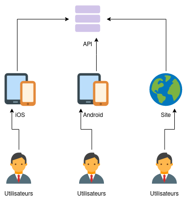

## 📋 Résumé du projet

Ta mission, créer un site type "e-commerce" (pas de panique), en HTML/CSS et Javascript.  
On te fourni le projet "back-end", tu dois donc créer le projet "front-end".  

### Back-end ?!

C'est un projet qui n'a pas d'interface graphique, il attend qu'on lui demande des informations et il répond ce qu'on lui demande.  

Exemples :

- Donne-moi la liste des produits
- Donne-moi les informations du produit avec l'identifiant _42_

On appelle ça une "API" (Application Programmation Interface).

### Front-end ?!

C'est la parti visible par les visiteurs, dans notre cas ici, c'est un site Javascript mais ça peut aussi être une application mobile ou un client lourd (logiciel).  
Prenez par exemple une application sur ton téléphone, Instagram. Il existe l'application iOS, Android et le site internet. Ces trois projets "front" sont connectés à la même API, ce qui permet d'avoir les données à un seul endroit



## 🔧 Installation du projet back-end (API)

Si tu as bien suivi, ce projet est déjà fait et fonctionnel.  
Mets-toi dans le dossier ou tu souhaites mettre l'API

```shell
$ git clone https://github.com/OpenClassrooms-Student-Center/JWDP5
$ cd JWDP5  
$ npm install  
$ npm run start
```

⚠️ Pour les deux dernières commandes, il va falloir que tu installes [NodeJS](https://nodejs.org/fr/) 

La dernière commande permet de lancer le serveur, ton terminal ne va pas te rendre la main, si tu vois le message **Listening on port 3000** c'est à dire que l'API attend d'être contactée 👌  
Garde ton terminal de côté car si tu fermes la fenêtre, ça va arrêter l'API ☹️

### Tester l'API

Maintenant que l'API est lancée, tu peux lui demander des informations, pour cela on va installer un **client API**, tu peux prendre [Insomnia API](https://insomnia.rest/) ou [Postman](https://www.postman.com/).  
Le premier étant plus simple, le deuxième est plus complet.

👉 _Tu peux aussi le faire directement sur VSCode en suivant cette article : [Arretez d'utiliser Postman](/article/transverse/arretez-d-utiliser-postman)_

Dans les spécifications du projet, tu peux voir 3 **endpoints** :

- GET /api/cameras
- GET /api/cameras/:id
- POST /api/order

On va récupérer les cameras en créant une nouvelle requête sur Insomnia par exemple, avec comme adresse : _http://localhost:3000/api/cameras_, pour la méthode on va laisser **GET**  
Tu peux envoyer la requête et si tout se passe bien, tu devrais avoir pareil que le screenshot ci-dessous :


À droite tu as donc la réponse de l'API que tu as lancée avant, qui écoute sur le port 3000 (pour ça que l'URL que tu mets dans ton logiciel est _http://localhost:3000_)

Le but ici va être de te créer un dossier "Orinoco" (comme j'ai fait sur le screen au dessus) avec les 3 requêtes à l'intérieur.  
Pour le deuxième GET c'est facile, il suffit de prendre l'id d'un article et de le mettre à la place de **:id**, l'API devrait te répondre seulement les informations de ce produit.  
Pour la troisième requête, n'oublie pas de mettre la méthode en POST, car ici ça ne sera pas une simple récupération d'informations mais une création, je te conseille de bien lire la documentation fournie avec le projet pour que ça fonctionne comme il faut 👍.

👉 La suite : [Partie 2](/article/dw/p5-bien-commencer-le-projet-part-2)

## 📚 Ressources utiles

[API Rest (cours OC)](https://openclassrooms.com/fr/courses/6573181-adoptez-les-api-rest-pour-vos-projets-web)