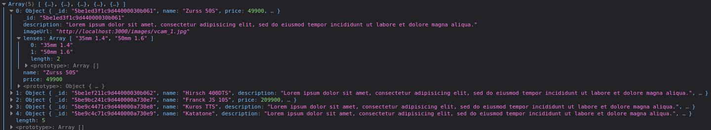

## 🧐 Réfléchir avant de coder

Important et pourtant très peu respecté, nous allons réfléchir un peu à comment on va s'y prendre.

C'est un site e-commerce, donc on va avoir besoin de :

- Afficher la liste des articles
- Afficher la page d'un article
- Ajouter un article dans son "panier"
- Passer commande (Avec récapitulatif et confirmation)

Trois de ces quatre points devraient te dire quelque chose normalement... 😉  
Et oui, ce sont des choses que nous avons déjà fait avec notre client API, il faut maintenant les faire en JS !

## 👨‍💻 Création du projet

Je te conseille d'y aller étape par étape. On va dans un premier temps créer le dossier du projet, avec dedans, un fichier _index.html_ et un fichier _index.js_.  
> 👉 Le Backend et le Frontend sont deux projets différents qui ne nécessitent pas d'être l'un dans l'autre ni même côte à côte. 
> L'initialisation de git devra se faire dans ton dossier de projet frontend, qui ne contient pas le backend et non dans un dossier parent qui contient ton front et ton back

Tu peux remplir ton fichier index.html : 

```html
<!DOCTYPE html>
<html lang="fr">
<head>
    <meta charset="UTF-8">
    <meta http-equiv="X-UA-Compatible" content="IE=edge">
    <meta name="viewport" content="width=device-width, initial-scale=1.0">
    <title>Orinoco</title>
</head>
<body>
    <h1>Bienvenue sur Orinoco</h1>
    <div id="articles"></div>
    <script src="index.js"></script>
</body>
</html>
```

La page d'accueil est censée afficher la liste des produits, que nous allons chercher en JS grâce à **Fetch** et les insérer dans notre div qui a l'id _articles_.

### Fetch

Fetch est une interface pour faire des requêtes HTTP en javascript, cela va te permettre de faire des requêtes HTTP, au même titre que ton client API (Insomnia, Postman...).  
Voici à quoi peut ressembler notre requête pour récupérer la liste des articles :

```js
fetch('http://localhost:3000/api/cameras')
  .then(response => response.json())
  .then(data => console.log(data));
```

Ici on GET (methode par défaut) sur notre API, une fois une réponse reçue, ça passe dans le premier **then**, qui transforme la réponse en JSON, une fois fait, ça passe dans 
le deuxième **then**, qui affiche les données (en JSON donc) dans la console.

👍 C'est très important de logger grâce au console.log() tout ce que tu fais, ça permet d'être certain du chemin, pour arriver à la bonne destination :)



Une fois le log "déplié", tu devrais avoir comme sur l'image ci-dessus.

🎉 Maintenant qu'on arrive à récupérer des données, on va les afficher de manière très basique, je ne vais pas tout faire à ta place non mais oh ! 😈

### Afficher les données

Pour cela, deux écoles : 

- Créer des éléments et les ajouter à des "nodes"
- Faire du innerHTML

> 👉 Pour des raisons de simplicité, je vais te montrer comment faire avec le innerHTML mais je t'invite à te renseigner pour le faire en manipulant le DOM proprement.

Nous allons modifier notre fetch pour qu'il ajoute le nom de l'article dans notre div **articles** :

```js
fetch('http://localhost:3000/api/cameras')
  .then(response => response.json())
  .then(data => document.getElementById('articles').innerHTML = data[0].name);
```

Si tu refresh la page, tu devrais voir "**Zurss 50S**" dessus, c'est ce nom-là qui est affiché car j'ai pris le nom du premier article du tableau (data[0]).  
Comme nous avons un tableau, on va devoir boucler dessus si on souhaite afficher tous les articles :

```js
fetch('http://localhost:3000/api/cameras')
  .then(response => response.json())
  .then(data => {
      const articlesContainer = document.getElementById('articles');

      for (let article of data) {
          articlesContainer.innerHTML += article.name;
      }
  });
```

> 👉 le += est super important pour ajouter du contenu à la suite, si tu mets juste un _=_, le contenu sera écrasé à chaque passage, tu n'auras donc que le nom du dernier article.

Et voilà ! Tu as tous les noms affichés, maintenant on va mettre un peu en forme tout ça car pour l'instant ce n'est pas trop lisible

### Template literals (Template strings)

Histoire de ne pas trop s'embêter avec la concaténation, nous allons utiliser les "template strings", voici deux bouts de code qui font la même chose :

```js
let test = 'Bonjour ' + name + ', tu as ' + age + 'ans';
let test = `Bonjour ${name}, tu as ${age}ans`;
```

> 👉 Le caractère qui entoure le template string est un backquote (`) et non un guillement simple, tu peux le faire sous windows et linux avec un **ALT GR + 7** et sur Mac OS c'est une touche à gauche de ta touche **entrée**

Si on l'applique à notre site : 

```js
fetch('http://localhost:3000/api/cameras')
  .then(response => response.json())
  .then(data => {
      const articlesContainer = document.getElementById('articles');

      for (let article of data) {
          articlesContainer.innerHTML += `${article.name} ${article.price}<br>`;
      }
  });
```

Mieux non ? 🤩

Il ne "reste plus" qu'à ajouter bootstrap pour rendre ton site plus beau et le tour est joué !

👉 La suite : [Partie 3](/article/dw/p5-bien-commencer-le-projet-part-3)

## 📚 Ressources utiles

[Template string](https://developer.mozilla.org/en-US/docs/Web/JavaScript/Reference/Template_literals)  
[Fetch](https://developer.mozilla.org/en-US/docs/Web/API/Fetch_API/Using_Fetch)