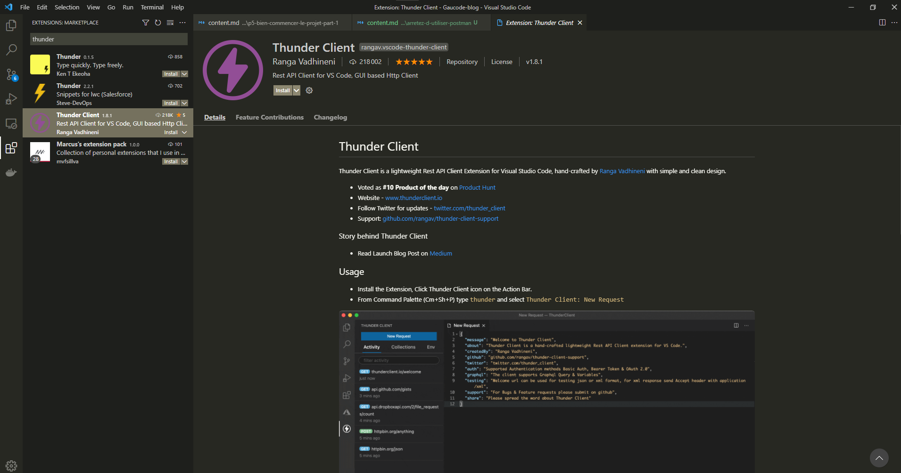
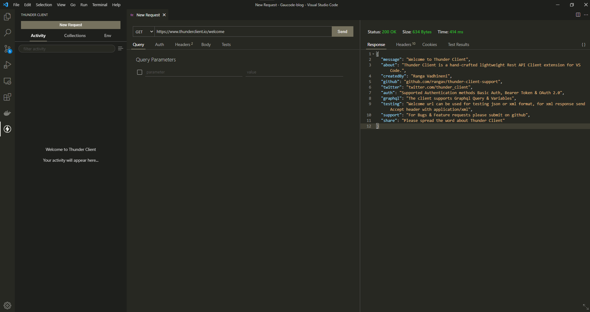

## Thunder Client

Dans cet article, je vais te parler d'une extension pour VS Code plutôt bien foutue : [Thunder Client](https://www.thunderclient.io). C'est en fait un client HTTP qui va te permettre de tester une API Rest ou GraphQL directement depuis ton IDE préféré 💖

### 💀 Pourquoi devrais-je arrêter d'utiliser Postman ?

Postman est un outil vraiment efficace et utilisé par la plupart des développeurs mais au fur et à mesure des mises à jours, le client de bureau devient de plus en plus lent et l'interface utilisateur commence à être **difficile à comprendre**.

Je pense ne pas me tromper en vous donnant ce second argument pour vous faire télécharger cette extension : **centraliser ses outils de travail**, pour une meilleure efficacité.

C'est quand même bien pratique de tout avoir au même endroit non ? Ca évite de démarrer 15 applis pour commencer à travailler. Lancez VS Code et vous aurez votre éditeur et votre client HTTP. Et en tant que développeur, j'aime l'optimisation 😎

### 🔧 Installation

Il suffit simplement de te rendre sur la page de [téléchargement du plugin](https://marketplace.visualstudio.com/items?itemName=rangav.vscode-thunder-client) sur le marketplace de Visual Studio. Il est également possible de le télécharger depuis le logiciel directement, dans l'onglet "Extensions" (Ctrl+Shift+X) et rechercher "Thunder Client".

Un redemarrage de VS Code sera sans doute nécessaire.

### 🤔 Comment ça marche ?

Si vous utilisiez Postman ou un autre client HTTP, vous ne serez pas perdu. Le client s'intègre de manière élégante et fluide à VS Code. Créez des nouvelles requêtes de type POST,GET,PATCH... rapidement ou créez des collections pour regrouper et ranger vos endpoints.

À vous de jouer !