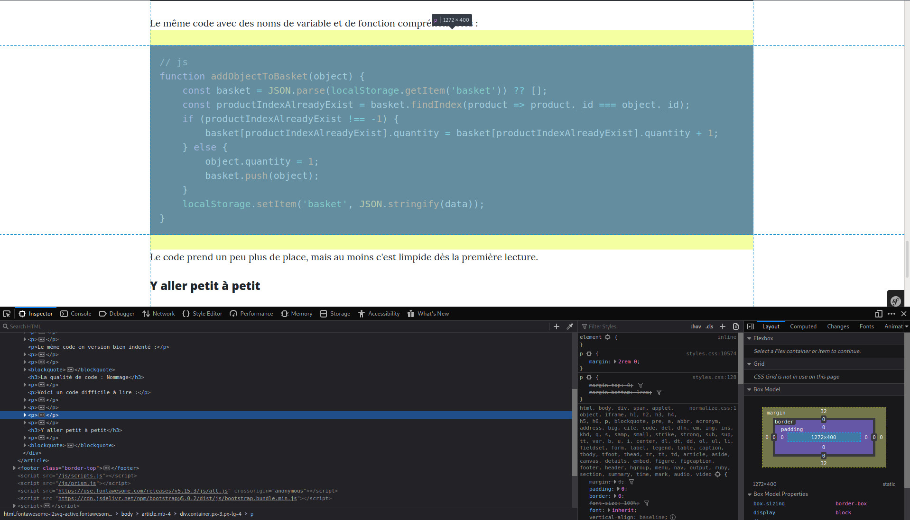

## 😨 J'AI UNE ERREUR ! COMMENT FAIRE ?!

Bonne nouvelle : **Ce n'est pas grave**, tu as peut-être l'impression de passer la plupart de ton temps de développement 
à résoudre des erreurs, je vais te donner des astuces pour les réduire un maximum et aussi pour bien les comprendre.

## 😃 Réduire nos erreurs

### 💎 La qualité de code : L'indentation

La première chose à respecter est une bonne **indentation**, c'est-à-dire d'avoir un bon respect des marges et des blocs en cascade.  
Voici l'exemple d'un code mal indenté :

```html
<html lang="fr">
<head>
    <title>Mon super site</title>
<link rel="stylesheet" href="css/style.css">
</head>
<body>
    <nav>
        <ul><li>Accueil</li>
    <li>Articles</li>
<li>A propos</li>
<li>Contact</li>
</ul>
</nav>
    <main>
            <article>
                <header>Article 1</header>
                <div>Contenu</div>
            </article>
        <article>
    <header>Article 2</header>
    <div>Contenu</div>
        </article>
            </main></body>
</html>
```

Le même code en version bien indenté :

```html
<html lang="fr">
    <head>
        <title>Mon super site</title>
        <link rel="stylesheet" href="css/style.css">
    </head>
    <body>
        <nav>
            <ul>
                <li>Accueil</li>
                <li>Articles</li>
                <li>A propos</li>
                <li>Contact</li>
            </ul>
        </nav>
        <main>
            <article>
                <header>Article 1</header>
                <div>Contenu</div>
            </article>
            <article>
                <header>Article 2</header>
                <div>Contenu</div>
            </article>
        </main>
    </body>
</html>
```

C'est tout de suite plus clair non ? Cela va te permettre de remarquer rapidement si tu as oublié de fermer une balise, 
car quand tu ouvres une balise (ou un bloc en JS, tel qu'une condition ou une boucle, par exemple), sont contenu doit être indenté 
(avoir une marge de quatre espaces). La balise fermante doit être sur la même "ligne" vertical que la balise ouvrante.

> 👉 Pour indenter une ou plusieurs lignes, tu peux les sélectionner et appuyer sur la touche "tabulation".  
> 👉 Pour "dé-indenter" une ou plusieurs lignes, tu peux les sélectionner et appuyer sur les touches "maj" et "tabulation".

### 💎 La qualité de code : Nommage

Bien nommer son code, pour qu'il se lise comme un livre.

Voici un code difficile à lire : 

```js
function test(d) {
    const a = JSON.parse(localStorage.getItem('a')) ?? [];
    const piae = a.findIndex(p => p._id === d._id);
    if (piae !== -1) {
        a[piae].q = a[piae].q + 1;
    } else {
        d.q = 1;
        a.push(d);
    }
    localStorage.setItem('a', JSON.stringify(d));
}
```

Le même code avec des noms de variable et de fonction compréhensibles : 

```js
function addObjectToBasket(object) {
    const basket = JSON.parse(localStorage.getItem('basket')) ?? [];
    const productIndexAlreadyExist = basket.findIndex(product => product._id === object._id);
    if (productIndexAlreadyExist !== -1) {
        basket[productIndexAlreadyExist].quantity = basket[productIndexAlreadyExist].quantity + 1;
    } else {
        object.quantity = 1;
        basket.push(object);
    }
    localStorage.setItem('basket', JSON.stringify(data));
}
```

Le code prend un peu plus de place, mais au moins c'est limpide dès la première lecture.

### 🐢 Y aller petit à petit

Quand tu écris du code, tu vas rarement être certain que celui-ci fonctionne du premier coup.  
Je te conseille donc de vérifier assez souvent ton avancement, cela réduit le champ d'action de la possible erreur si elle 
se présente. Pour du HTML/CSS, tu peux rafraichir la page souvent, pour du JS, je te conseille de faire beaucoup de console.log() 
pour vérifier que tu as les données que tu désires.

> 👉 Si tu dois console.log() un tableau, la méthode console.table() est plus visuel.

## 🤓 Comment réagir face à une erreur ?

Première chose : Ne pas paniquer, c'est normal d'avoir des erreurs, c'est grâce à elles qu'on avance et qu'on apprend.

### 🔥 Erreur "visuelle" (HTML/CSS)

Pour résoudre une erreur visuelle (HTML/CSS), votre navigateur vous donne accès à des outils de développement. 
Pour lancer l'inspecteur d'éléments, c'est la touche F12, tu peux aussi faire un clique droit sur ton élément HTML et 
cliquer sur "Inspecter l'élément" (le message dépend du navigateur)



Sur le screenshot ci-dessus, tu peux voir mon inspecteur d'élément (j'ai changé le thème, le tiens sera peut-être blanc).  

- Sur la première partie, celle de gauche, c'est le code HTML de la page, tu peux déplier les éléments et passer ton curseur 
sur les balises pour mettre le bloc en surbrillance, et ainsi afficher sur ce bloc, ses dimensions, ses bordures (border), 
ses marges externes (margin) et internes (padding)  
> 👉 Tu peux aussi éditer le HTML, supprimer des balises etc

- La deuxième partie, tu vas retrouver les attributs CSS appliqués et hérités par la balise que tu as sélectionnée.  
Tu peux éditer les valeurs, supprimer l'attribut et en ajouter, pratique pour faire des tests sans devoir modifier le code.

- La troisième partie donne des informations sur ton bloc (flexbox, grid, ...), les polices et d'autres outils un peu plus avancés.

> 👉 Les modifications dans l'inspecteur ne se répercutent pas sur ton code, si tu rafraichis la page, tu vas perdre toutes tes modifications !

### 🔥 Erreur JS

Dès que tu vas avoir une erreur en javascript, celle-ci se retrouvera dans la console, c'est le deuxième onglet (la plupart du temps), 
dans ton inspecteur. C'est ici aussi que tu retrouveras tes console.log().
> 👉 Regarde bien si tu n'as pas des filtres qui masques certaines erreurs.

C'est bête, mais c'est très important de bien lire l'erreur et de bien le comprendre, souvent on a tendance à la lire 
rapidement et d'ouvrir son code pour chercher la solution.  
Si c'est une de tes fonctions qui ne fonctionne pas et que l'erreur ne te parle pas, tu peux mettre des console.log() 
avec dedans des variables ou du texte, pour connaitre le contenu de ta variable, si tu mets du texte, c'est souvent 
pour vérifier que ton code passe bien par là.

Dans la console de ton navigateur tu peux aussi écrire du javascript directement si tu veux tester un bout de code rapidement.

L'inspecteur d'élément et la console sont tes alliés ! Abuse s'en !


