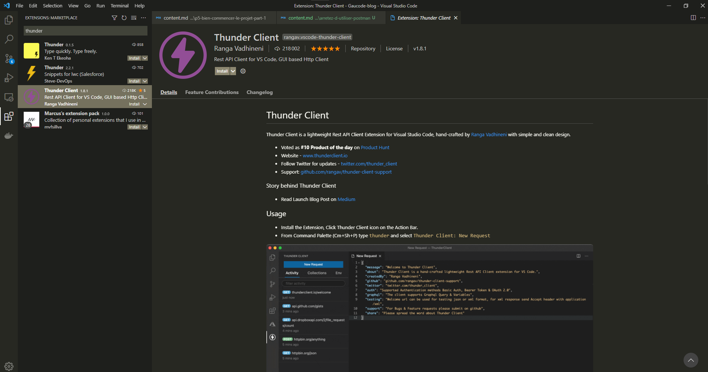
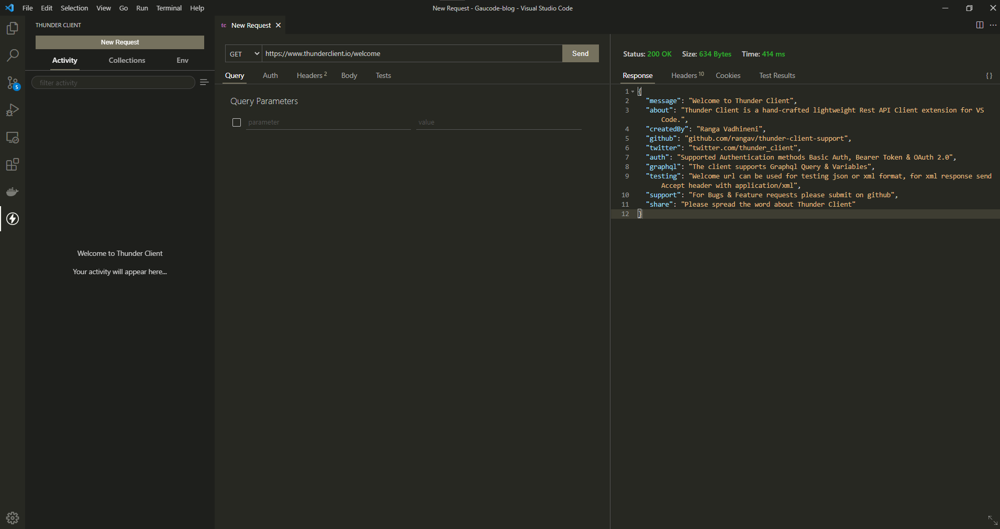
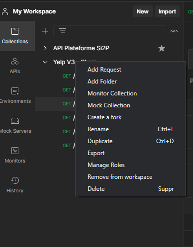
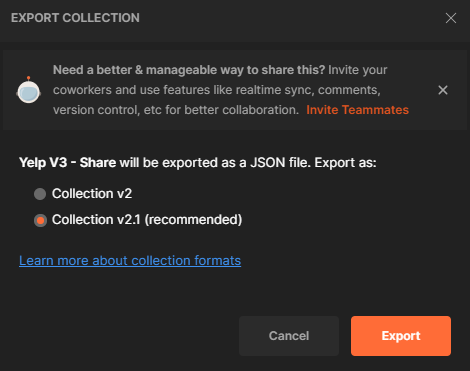
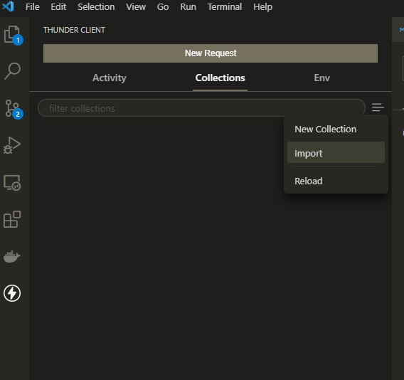
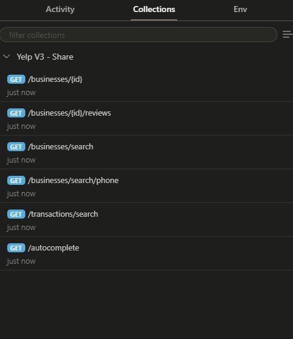

## Introduction

Quelle est la meilleure façon de **structurer une application Vue.js** pour qu'elle reste maintenable et extensible au fur et à mesure qu'elle évolue ? C'est une question que je me suis posé et que j'ai entendue à de nombreuses reprises et je pense que la réponse à cette question n'est pas des plus simple. Lorsqu'il s'agit de créer un projet évolutif, nous voudrions avoir tout prévu et que tout soit **sous contrôle.**

D'après mon expérience et ce que j'ai pu lire et voir au cours de mes projets, la clé **c'est la simplicité.**

Pourquoi est-ce important ? Eh bien, comme moi, vous avez probablement eu l'occasion de reprendre un vieux projet ou de vous greffer à un projet en cours de développement, vous ouvrez le code et vous vous dites : "Je ne sais même pas par où commencer !".

**Une base de code simple** vous permettra de ne plus vous retrouver dans cette situation, ce qui facilite l'intégration de nouveaux développeurs aux projets et rend le travail continu plus efficace.

### 💀 Que faire pour optimiser ?

Postman est un outil vraiment efficace et utilisé par la plupart des développeurs. Malgré ses nombreux avantages (tests automatisés, gestion des tests, gestion du cycle de vie des API entre autres), le client de bureau devient de plus en plus lent au fur et à mesure des mises à jours et l'interface utilisateur commence à être **difficile à comprendre**.

Je pense ne pas me tromper en vous donnant ce second argument pour vous faire télécharger cette extension : **centraliser ses outils de travail**, pour une meilleure efficacité.

C'est quand même bien pratique de tout avoir au même endroit non ? Ça nous évite de démarrer 15 applis pour commencer à travailler. Lancez VS Code et vous aurez votre éditeur et votre client HTTP. Et en tant que développeur, j'aime ce genre d'optimisation 😎

### 🔧 Installation

Il suffit simplement de te rendre sur la page de [téléchargement du plugin](https://marketplace.visualstudio.com/items?itemName=rangav.vscode-thunder-client) sur le marketplace de Visual Studio. Il est également possible de le télécharger depuis le logiciel directement, dans l'onglet "Extensions" (Ctrl+Shift+X) et rechercher "Thunder Client".

Un redémarrage de VS Code sera sans doute nécessaire.

### 🤔 Comment ça marche ?

Si vous utilisiez Postman ou un autre client HTTP, vous ne serez pas perdu. Le client s'intègre de manière élégante et fluide à VS Code. Créez des nouvelles requêtes de type POST,GET,PATCH... rapidement ou créez des collections pour regrouper et ranger vos endpoints.

### 📂 Importer une collection depuis Postman

Et oui, c'est possible ! Pour faciliter votre transition de Postman vers Thunder Client, voici la marche à suivre :

- Ouvrez Postman et sélectionnez la collection que vous voulez exporter

- Sélectionnez Collection v2.1

- Ouvrez l'onglet Thunder Client sur VS Code puis cliquez sur l'icône et "Importer". Importez le fichier json que vous avez exporté depuis Postman.

- Vous pouvez maintenant jouer avec votre collection Postman sur VS Code !

À vous de jouer !