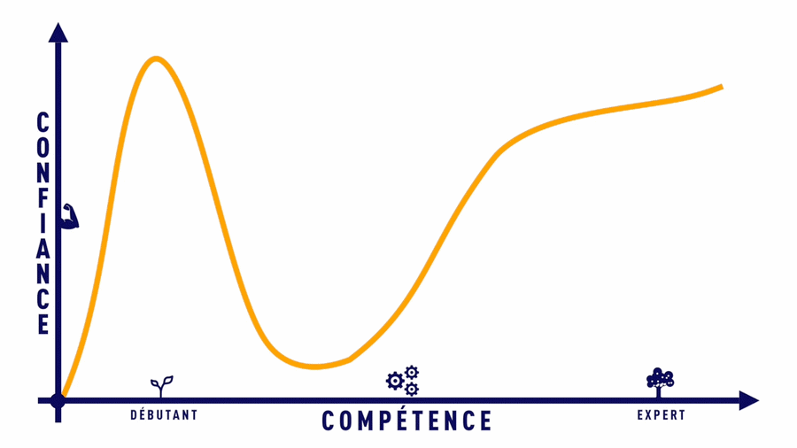

Je vais commencer par mettre un peu de contexte, car cet article est écrit en fonction de mon point de vue et de mes expériences, aussi bien en tant que candidat que recruteur.

J'ai réalisé un peu d'entretiens d'embauche, un peu plus d'entretiens de missions (je suis dans une ESN), et j'ai fait passer beaucoup d'entretiens, au final j'ai plus d'expérience en tant que recruteur que candidat.

## 📢 Le marché

Oui, le marché recrute MAIS, le niveau d'exigence est assez haut par rapport à la réalité du marché.  
Si tu es junior, tu vas avoir du mal à trouver un emploi (désolé de te l'apprendre 😨). Le marché est saturé de juniors (bons ou mauvais).

C'est pour cela que, quand on cherche un développeur avec 5 ans d'expérience, nous recevons une 50^(aine) de CV de juniors qui viennent de sortir d'école ou de "bootcamp" (formations accélérées qui promettent la Lune en 6 mois).

HEUREUSEMENT, il y a des astuces qui permettent de se démarquer et d'au moins passer la phase de sélection des CV.

## 🧾 Phase 1 : Le CV

Comme tu le sais, nous recevons beaucoup de CV, l'idée c'est de taper vite et fort.

Ton CV doit être **propre, épuré, lisible, cohérent avec la mission**. Je ne vais pas t'expliquer comment faire un CV ici, mais il faut que ça soit comme quand tu rentres dans un Apple Store.

Pour les expériences, tu vas te limiter à écrire : 

- Le nom de l'entreprise / projet
- Les dates
- Ton poste, _Lead Dev Symfony, équipe Retail_, par exemple

**Ne mets pas tout ce que tu connais !** Quelqu'un qui en met trop, c'est quelqu'un qui veut impressionner, alors qu'au final il se passe l'inverse.  
Souvent, je vois : "VSCode, VSCodium, VSStudio, PHPStorm, Eclipse, Notepad++, Code::Blocs, etc", personnellement, savoir que tu connais autant d'IDE m'importe peu, par contre tu peux mettre ton environnement de travail favori, exemple : "Ubuntu, PHPStorm, Postman", pourquoi pas.

**Attention aux fautes** dans le nom des technos, combien de fois je vois "Boostrap" ou "Symphony", pour moi c'est rédhibitoire.
> J'ai déjà vu "DQL avec Doctrine", DQL voulant dire _Doctrine Query Language_, je me suis vite aperçu de son niveau en DQL...

**Attention à l'auto-évaluation de tes compétences**, sous forme de bar de progression par exemple, personnellement je n'aime pas cela et quand un candidat se met 9/10 dans une techno, j'ai envie de tester ses connaissances pour vérifier ça. C'est très difficile d'avoir 9/10 dans une techno, tellement c'est vaste.  

## 🗒 Phase 2 : Résumé de tes missions & projets

Pour accompagner ton CV, tu peux  aussi envoyer un document qui explique un peu plus en détails tes _expériences professionnelles_ et tes _projets personnels_.

Cela va permettre au recruteur qui lit ton CV, d'en savoir plus s'il est intéressé.  
Dans ce document, tu peux faire une page par mission en détaillant la mission :

- Le nom de l'entreprise / projet
- Les dates
- Ton poste, _Lead Dev Symfony, équipe Retail_, par exemple
- Le lieu
- Tes principales tâches (Exemple : Création d'une API REST avec ApiPlatform, à destination des partenaires, utilisation de MongoDB avec Doctrine ODM...)
- Un résumé des technologies utilisées pour simplifier la lecture (tu peux mettre les logos, ça fait moins austère ;))

## 🤝 Phase 3 : L'entretien

Pense a **préparer ton entretien** au minimum, c'est-à-dire te renseigner sur l'entreprise, tu dois bien connaitre l'offre d'emploi, lis la plusieurs fois, si certains termes ou technos ne te disent rien, fait une petite recherche pour au moins savoir à quoi ça sert.

**N'ai pas honte de ne pas savoir**, pour être recruté, tu ne dois pas cocher toutes les cases, s'il y a une techno que tu ne connais pas, n'hésite pas à dire que tu ne connais pas et que tu souhaites en savoir plus. Soit curieux !

Pour le **code vestimentaire**, vu que nous sommes dans le domaine de l'informatique, une tenue "de tous les jours" suffit, personnellement j'ai tendance à me méfier des gens trop bien habillés, en costard par exemple. D'après mon expérience, quand on misent sur la forme, c'est pour compenser le fond.

**Soit naturel !** Ne te met pas la pression et sache qu'un entretien c'est dans les deux sens, l'entreprise doit aussi donner une bonne image pour que tu veuilles accepter la mission. Personnellement j'ai refusé des missions suite aux comportements des recruteurs que je n'ai pas appréciés.

## ⭐️ Autre 

Si tu as des projets personnels et je t'encourage fortement à en avoir pour te démarquer, n'en ai pas honte, met-les dans tes expériences sur ton CV et parle en lors de l'entretien.

Pareil pour tes passions, cela t'humanise, car au-delà de recruter un développeur, on recrute un futur collègue avec qui on va passer du temps, penses-y ;)

## 📚 Ressources

[Courbe de confiance](https://www.lumerys.com/effet-dunning-krugger-surconfiance/)