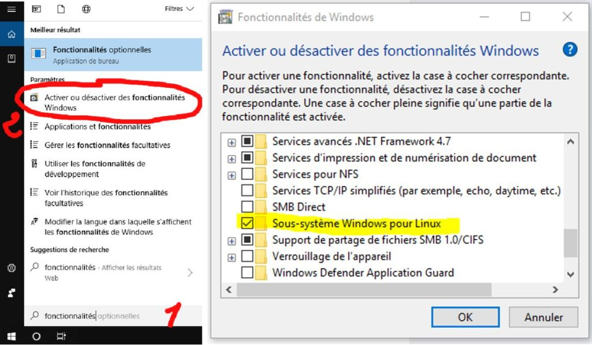
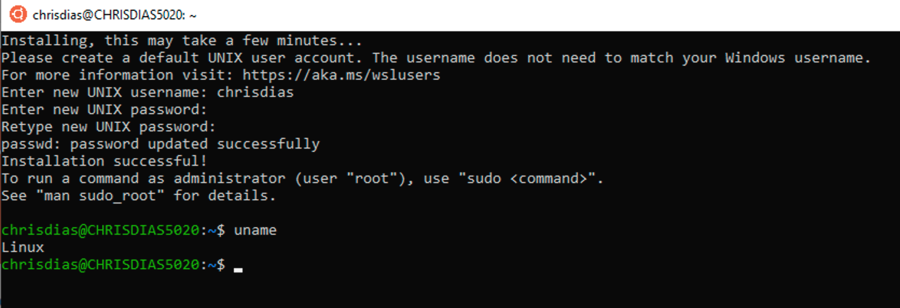
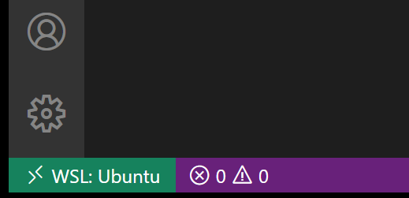

## Introduction

Dans cet article, nous allons voir comment utiliser Linux sur Windows sans machine virtuelle ni dual boot, avec une simple extension VSCode 😇

### 😳 Comment c'est possible ?

Windows est un système d'exploitation très largement critiqué, en bien ou en mal et à tord ou à raison par la communauté des développeurs.

Personnellement, je trouve que Windows 10 est le meilleur OS. Il permet de tout faire et il est très **polyvalent**. On peut aussi bien l'utiliser pour jouer que pour travailler.

Mais ce n'est pas le sujet de cet article 😅

Ici nous allons voir comment faire pour utiliser le terminal et tout **l'environnement de Linux** sans quitter Windows grâce à une simple extension. C'est possible grâce à la technologie  WSL de Windows, l'acronyme de Windows subsystem for Linux.

Cette technologie, qui est en version 2 à l'heure où j'écris ces lignes, est super intéressante, elle vous permet d'exécuter **un environnement Linux directement sur Windows**, sans la surcharge d'une machine virtuelle traditionnelle ou d'une configuration en dual boot 😎

Lorsque vous installez une version de Linux sur Windows grâce à WSL, vous obtenez un environnement Linux complet. Il est **isolé de Windows**, l'interface utilisateur est le terminal et vous pouvez installer des outils, des langages et des compilateurs dans l'environnement Linux **sans modifier** ni **perturber** votre installation Windows.

La puissance de VSCode nous permet de centraliser tous ces outils géniaux et c'est un luxe en tant que développeur. Si ça vous intéresse, on passe à **l'installation** !

### 🔧 Installation

#### Installer le plugin

Rendez-vous sur la page de [téléchargement du plugin](https://marketplace.visualstudio.com/items?itemName=ms-vscode-remote.remote-wsl) sur le marketplace de Visual Studio, le plugin est fourni par Microsoft. Il est également possible de le télécharger depuis le logiciel directement, dans l'onglet "Extensions" (Ctrl+Shift+X) et rechercher "Remote WSL".

Un redémarrage de VS Code sera sans doute nécessaire.

Vous allez voir un nouvel item en bas à gauche de votre éditeur

Cet item peut vous montrer rapidement dans quel contexte VS Code s'exécute (local ou distant) et cliquer sur l'élément fera apparaître les commandes de l'extension.

#### Activer WSL sur Windows

WSL est une fonctionnalité facultative sur Windows 10. Vous pouvez l'activer via les fonctionnalités Windows.

Dans la barre de recherche Windows, tapez « fonctionnalités » pour ouvrir "Activer et désactiver les fonctionnalités Windows". Faites défiler vers le bas et cochez le sous-système Windows pour Linux.

#### Installer une distribution de Linux

Vous devrez installer les distributions Linux pour WSL à partir du Microsoft Store. Vous pouvez aller sur Microsoft Store ou rechercher une distribution Linux dans la barre de recherche Windows. Choisissez la distribution Linux que vous souhaitez installer (par exemple Ubuntu) et suivez les instructions.

Une fois l'installation terminée, cliquez sur "Lancer". Cela ouvrira un terminal Linux et terminera l'installation. Vous devrez créer un utilisateur et un mot de passe pour créer votre instance Linux. Vous utilisez maintenant Linux sur Windows 😲

#### Rendez-vous sur VSCode et c'est parti !

Ouvrez votre terminal et commencez à travailler sur votre nouvel environnement Linux !

À vous de jouer ! 🥳